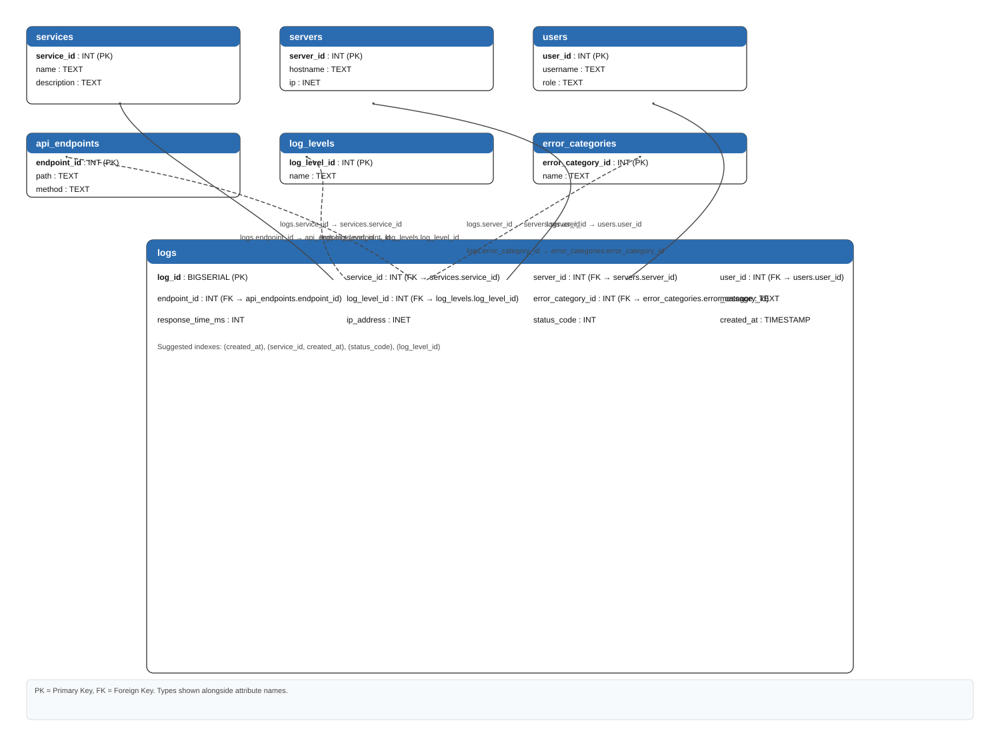

# Database Design

## Core Tables

- `services` stores application services that produce logs.
- `servers` stores host information for log sources.
- `users` stores user metadata for user-related events.
- `api_endpoints` stores API paths and request methods.
- `log_levels` stores severity levels such as INFO, WARN, and ERROR.
- `error_categories` stores error groupings for analysis.
- `logs` stores the main event stream and links to all reference tables.

## Key Relationships

- `logs.service_id` references `services.service_id`
- `logs.server_id` references `servers.server_id`
- `logs.user_id` references `users.user_id`
- `logs.endpoint_id` references `api_endpoints.endpoint_id`
- `logs.log_level_id` references `log_levels.log_level_id`
- `logs.error_category_id` references `error_categories.error_category_id`

## Design Notes
 - `logs` uses `request_id` for traceability across services.
 - `created_at` uses `TIMESTAMPTZ` for timezone-aware log analysis.
 - `response_time_ms` and `status_code` include constraints for data quality.
 - Reference tables reduce repeated metadata and keep the schema normalized.

## ERD image

Included an ERD image from `docs/images/erd.svg`

